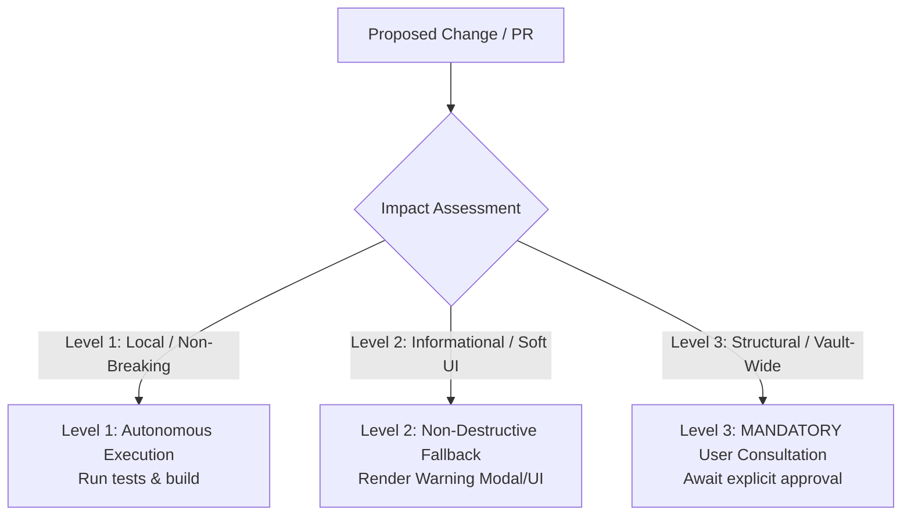

# Folder Notes Studio: Architectural Blueprint & Plugin Structure

## 1. Core Tenets & Architecture
1. **Zero External Lock-In**: Folder notes are native Markdown (`.md`), Canvas (`.canvas`), or Excalidraw (`.excalidraw`) files stored directly within the vault file system without proprietary wrappers or database silos.
2. **Deterministic Folder-Note Binding**: Resolving folder notes strictly respects user settings:
   - `storageLocation`: `'insideFolder'` (default: `Folder/Folder.md`), `'parentFolder'` (`Folder.md` next to `Folder/`), or `'vaultFolder'`.
   - `folderNoteName`: Name template with `{{folder_name}}` token replacement or custom static strings.
3. **Safe DOM & MutationObserver Lifecycle**: File explorer DOM alterations must be debounced, idempotent, and cleaned up on plugin unload (`unregisterFileExplorerObserver()`) to prevent memory leaks and UI stutter.
4. **Non-Destructive File Operations**: Moving, renaming, or deleting folders and folder notes must handle user confirmation prompts (`showDeleteConfirmation`, `showRenameConfirmation`), sync operations safely, and never delete non-folder-note files inadvertently.
5. **Zero Unicode Emojis**: Enforce Lucide SVG icons exclusively in UI views, notices, modals, and settings tabs (`setIcon(el, "...")`).

---

## 2. Directory & Component Structure
```
obsidian-folder-notes/
├── src/
│   ├── main.ts                      # Plugin lifecycle, settings loader, command registrations, DOM init
│   ├── Commands.ts                  # Obsidian command palette integrations
│   ├── globals.d.ts                 # Obsidian internal typings extensions
│   ├── template.ts                  # Template engine & file content injection
│   ├── events/                      # Event Listeners & Observers
│   │   ├── MutationObserver.ts      # File explorer DOM mutation observer & breadcrumbs
│   │   ├── handleClick.ts           # File explorer folder click interceptor
│   │   ├── handleCreate.ts          # Vault create event listener & auto-creation
│   │   ├── handleDelete.ts          # Vault delete event listener & sync deletion
│   │   ├── handleRename.ts          # Vault rename listener & folder-note sync
│   │   ├── FrontMatterTitle.ts      # Frontmatter title plugin interoperability
│   │   ├── TabManager.ts            # Tab title synchronization
│   │   └── EventEmitter.ts          # Internal event dispatching
│   ├── functions/                   # Core Business Logic & Helpers
│   │   ├── folderNoteFunctions.ts   # createFolderNote, getFolderNote, openFolderNote, path calculations
│   │   ├── styleFunctions.ts        # DOM class injection (has-folder-note, active highlights)
│   │   ├── ListComponent.ts         # Folder list component renderer
│   │   ├── excalidraw.ts            # Excalidraw view helpers
│   │   ├── generateId.ts            # Unique ID generation
│   │   └── utils.ts                 # Path extraction, extension sanitization, leaf helpers
│   ├── settings/                    # Settings UI Architecture
│   │   ├── SettingsTab.ts           # Main tab container & navigation
│   │   ├── GeneralSettings.ts       # Note naming, auto-create, default filetype, click mode
│   │   ├── FileExplorerSettings.ts  # Collapse icon, hiding, underlines, badges, highlights
│   │   ├── PathSettings.ts          # Storage location, root path rules
│   │   ├── ExcludedFoldersSettings.ts # Excluded folders & patterns
│   │   ├── FolderOverviewSettings.ts  # Folder overview integration
│   │   └── modals/                  # Settings confirmation modals
│   ├── modals/                      # User Interaction Modals
│   ├── suggesters/                  # File & Folder Auto-Suggest Modals
│   ├── ExcludeFolders/              # Excluded / Whitelisted folder logic
│   └── obsidian-folder-overview/    # Submodule: Cards, Tables, Kanban views for folder content
├── public/                          # Static Source Assets (manifest.json, styles.css)
├── dist/                            # Generated Release Artifacts (gitignored: main.js, manifest.json, styles.css)
├── scripts/                         # Build, packaging & version management
│   ├── package.mjs                  # Release packaging & bundle verification
│   ├── version-bump.mjs             # 3-way atomic semantic version bumping
│   └── extract-release-notes.mjs    # Release notes extractor from CHANGELOG.md
├── tests/                           # In-Repo Automated Test Harness (Bun native runner + Obsidian Mock)
│   ├── obsidian_mock.ts             # Obsidian API Mock
│   ├── run_all_tests.ts             # Master test runner
│   ├── test_folder_note_functions.ts # Path & naming resolution tests
│   ├── test_storage_locations.ts    # insideFolder vs parentFolder vs vaultFolder tests
│   ├── test_settings_and_defaults.ts # Settings initialization & migrations
│   └── test_invariants_and_zero_emoji_audit.ts # Codebase invariants & SVG icon audits
└── esbuild.config.mjs               # Modern esbuild bundler with .env vault auto-sync
```

---

## 3. Subsystem Specifications

### 3.1 Path & Naming Strategy Resolution
* **Inside Folder (`insideFolder`)**: Note located at `<folderPath>/<folderName><ext>` (or `<folderPath>/<customTemplate><ext>`).
* **Parent Folder (`parentFolder`)**: Note located at `<parentFolderPath>/<folderName><ext>` alongside the folder.
* **Vault Folder (`vaultFolder`)**: Note located at `<vaultRoot>/<folderName><ext>`.
* **Template Token Replacement**: `{{folder_name}}` replaced with `getFolderNameFromPathString(folderPath)`.

### 3.2 File Explorer DOM Mutation Handling
* **Idempotent Class Management**: Attaching `.has-folder-note` or active folder styling must query existing DOM nodes and apply diffs without re-rendering unaffected tree elements.
* **Navigation Interception**: Single click / Ctrl+Click / Alt+Click actions are intercepted in `handleClick.ts` to open folder notes according to `settings.openByClick`, `settings.openWithCtrl`, and `settings.openWithAlt`.

### 3.3 Folder & Note Synchronization
* **Rename Propagation**: When a folder is renamed, if `syncFolderName: true`, the associated folder note is renamed automatically via `app.fileManager.renameFile()`.
* **Delete Propagation**: When a folder is deleted, if `syncDelete: true`, confirmation prompts guard against accidental deletion according to `settings.deleteFilesAction` (`'delete' | 'trash' | 'obsidianTrash'`).

---

## 4. 3-Level Impact Governance Checklist



### Level 1: Autonomous Execution (Safe / Local / Non-Breaking)
* Bugfixes in string parsing, path utilities, styling polish, adding unit tests in `tests/`, zero-emoji enforcement (`setIcon(el, "...")`).
* Protocol: Execute directly, verify with `bun run test:all`, build with `bun run build`.

### Level 2: Non-Destructive Enhancements (Soft UI / Guardrails)
* Rendering confirmation modals before batch operations, warning when template files are missing, disabling destructive buttons when paths are invalid.

### Level 3: Mandatory User Consultation (Structural / File Operations)
* Changing default storage location logic, altering `settings.json` schema properties, performing batch renames across existing folder notes in the vault, modifying submodule relationships.
* Protocol: **STOP and ask the user first** with structured options via `ask_question`.

---

## 5. Release & Verification Protocol
1. **Automated Verification**: `bun run test:all` (must execute 100% clean).
2. **Build Verification**: `bun run build` (must compile clean with zero errors).
3. **Packaging Verification**: `bun run package` (verifies `dist/main.js`, `dist/manifest.json`, `dist/styles.css`).
4. **Version Bump**: `bun run version:patch` / `minor` / `major` (synchronizes `package.json`, `public/manifest.json`, `versions.json`).

