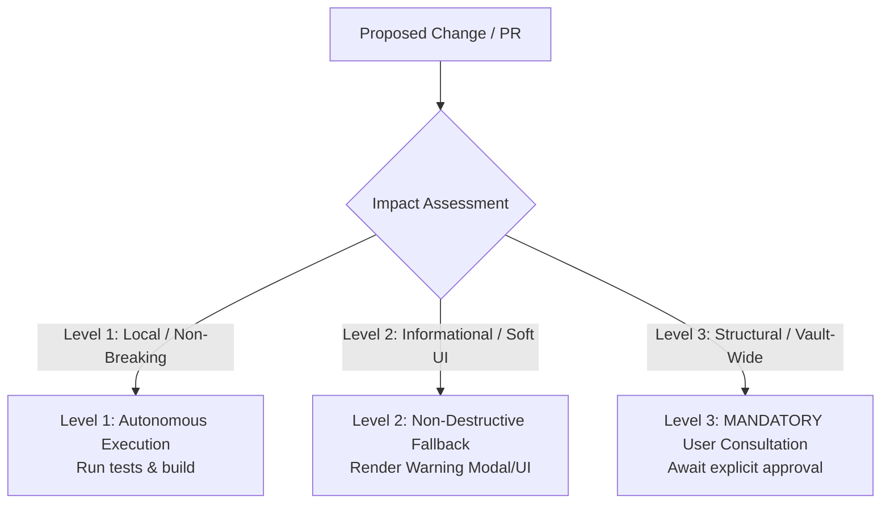

# Folder Notes Studio: Architectural Blueprint & Plugin Structure

## 1. Core Tenets & Architecture
1. **Zero External Lock-In**: Folder notes are native Markdown (`.md`), Canvas (`.canvas`), or Excalidraw (`.excalidraw`) files stored directly within the vault file system without proprietary wrappers or database silos.
2. **Deterministic Folder-Note Binding**: Resolving folder notes strictly respects user settings:
   - `storageLocation`: `'insideFolder'` (default: `Folder/Folder.md`), `'parentFolder'` (`Folder.md` next to `Folder/`), or `'vaultFolder'`.
   - `folderNoteName`: Name template with `{{folder_name}}` token replacement or custom static strings.
3. **Safe DOM & MutationObserver Lifecycle**: File explorer DOM alterations must be debounced, idempotent, and cleaned up on plugin unload (`unregisterFileExplorerObserver()`) to prevent memory leaks and UI stutter.
4. **Non-Destructive File Operations**: Moving, renaming, or deleting folders and folder notes must handle user confirmation prompts (`showDeleteConfirmation`, `showRenameConfirmation`), sync operations safely, and never delete non-folder-note files inadvertently.
5. **Zero Unicode Emojis**: Enforce Lucide SVG icons exclusively in UI views, notices, modals, and settings tabs (`setIcon(el, "...")`).
6. **Direct Source Imports (Zero Proxy Invariant)**: When refactoring or extracting code, all consumers must directly refer to the true source functionality. Never create intermediate facade / proxy files (`export * from '...'`) that introduce unnecessary import layers.
7. **Reactive Zero-Restart Tenet**: All setting modifications must update the live environment dynamically (refreshing DOM classes, rebuilding observers, updating tab titles, re-binding click listeners) without displaying "Requires a restart to take effect" workarounds.
8. **Baked-In In-Tree Subsystem Architecture**: Submodules (specifically `obsidian-folder-overview`) must be absorbed in-tree as first-class citizens in `src/backend/` and `src/frontend/` with full backwards compatibility for existing `data.json` schemas.
9. **Efficient Document Indexing & Scanning**: Vault document metadata propagation and indexing must follow high-performance reactive caching and lazy evaluation patterns.
10. **Collaborative Live Telemetry & Log-Driven Diagnostics**: Maintain structured JSON logging in `.obsidian/plugins/folder-notes/debug.log` and support rapid modal observation capture. All UI bug investigations must begin by tailing and analyzing live telemetry before proposing code changes.
11. **Strict 3-Zone Click & DOM Invariants**: Differentiate Chevron (`.collapse-icon`), Folder Text (`.tree-item-inner`), and Row Whitespace (`.tree-item-self`). Never call `stopImmediatePropagation()` on whitespace or chevron clicks when collapsing is configured. Never apply `:has()` styling to generic parent tree containers.
12. **Idempotent Graph View Link Injection & Leaf Lifecycle**: Guard link list file modifications with content-equality checks to prevent infinite re-render loops and graph flickering. Always detach view leaves on `onunload()` and enforce single-instance leaves on view activation.
13. **Automated Testbed Deployment Pipeline**: All changes must pass `bun test:all`, build cleanly via `bun run package`, and be verified via `bun run testbed:verify` before testing in Obsidian.

---

## 2. Directory & Component Structure
```
obsidian-folder-notes/
├── .agents/
│   ├── rules/clarification-and-handover.md # Always-on clarification & 5-part handover rule
│   └── skills/folder-notes-studio/SKILL.md  # Domain skill manual
├── .env.example                            # Vault sync template
├── .gitignore
├── .nvmrc                                  # Pinned Node LTS
├── dist/                                   # Verified production bundle (main.js, manifest.json, styles.css)
├── docs/                                   # Architectural and environmental documentation
├── esbuild.config.mjs                      # esbuild bundler + Sass compilation + .env sync
├── package.json                            # Clean dependencies and Bun/Node scripts
├── public/                                 # Static source assets (manifest.json, styles.css)
├── scripts/                                # Release and versioning automation
├── src/
│   ├── backend/                            # Pure TypeScript backend logic & domain services
│   │   ├── core/                           # FolderNoteResolver, FolderNoteService, ExcludeService, TemplateService, ExcalidrawService, OverviewService
│   │   ├── events/                         # FileExplorerObserver, NavigationInterceptor, VaultSyncHandler, TabManager, FrontMatterTitle, EventEmitter
│   │   ├── types/                          # settings.ts, exclude.ts, events.ts, overview.ts, index.ts
│   │   ├── utils/                          # pathUtils.ts, domUtils.ts, idUtils.ts, indexDbUtils.ts
│   │   └── index.ts
│   ├── frontend/                           # Obsidian UI components, settings, modals & styles
│   │   ├── components/                     # ListComponent.ts, OverviewCards.ts, OverviewList.ts
│   │   ├── modals/                         # AddSupportedFileTypeModal, DeleteConfirmationModal, etc.
│   │   ├── settings/                       # SettingsTab.ts, sub-tab sections, ExcludedFolderListItems.ts
│   │   ├── styles/                         # Modular SCSS (_variables, _mixins, _base, _explorer, _modals, _settings, _overview, main.scss)
│   │   ├── suggesters/                     # FileSuggester, FolderSuggester, TemplateSuggester
│   │   ├── views/                          # FolderOverviewView.ts
│   │   └── index.ts
│   ├── Commands.ts                         # Command palette registrations
│   ├── globals.d.ts                        # Typings extensions
│   └── main.ts                             # Plugin lifecycle entrypoint
├── tests/                                  # In-repo automated test harness
└── styles.css                              # Root CSS for direct repo symlink setups
```

---

## 3. Subsystem Specifications

### 3.1 Path & Naming Strategy Resolution
* **Inside Folder (`insideFolder`)**: Note located at `<folderPath>/<folderName><ext>` (or `<folderPath>/<customTemplate><ext>`).
* **Parent Folder (`parentFolder`)**: Note located at `<parentFolderPath>/<folderName><ext>` alongside the folder.
* **Vault Folder (`vaultFolder`)**: Note located at `<vaultRoot>/<folderName><ext>`.
* **Template Token Replacement**: `{{folder_name}}` replaced with `getFolderNameFromPathString(folderPath)`.

### 3.2 File Explorer DOM Mutation Handling
* **Idempotent Class Management**: Attaching `.has-folder-note` or active folder styling queries existing DOM nodes and applies diffs without re-rendering unaffected tree elements.
* **Navigation Interception**: Single click / Ctrl+Click / Alt+Click actions are intercepted in `NavigationInterceptor.ts` to open folder notes according to settings.

### 3.3 Folder & Note Synchronization
* **Rename Propagation**: When a folder is renamed, if `syncFolderName: true`, the associated folder note is renamed automatically via `app.fileManager.renameFile()`.
* **Delete Propagation**: When a folder is deleted, if `syncDelete: true`, confirmation prompts guard against accidental deletion according to `settings.deleteFilesAction`.

### 3.4 In-Tree Folder Overview Subsystem
* **Markdown Codeblock Processing**: Processes ````folder-overview ... ```` codeblocks and renders customizable cards/lists/grids of subfolder contents.
* **Reactive Metadata Cache**: Uses indexed cache and debounced vault listener diffs to update overview listings without freezing vault indexing.

---

## 4. 3-Level Impact Governance Checklist



* **Level 1 (Autonomous)**: Formatting, SCSS styling tweaks, adding non-breaking unit tests, pure helper extractions.
* **Level 2 (Informational)**: UI modal changes, new non-default settings toggles, adding new optional command palette entries.
* **Level 3 (User Approval Required)**: Modifying vault write/delete behaviors, changing default storage schemas, migrating `data.json` structure, altering file explorer click interception mechanics.

---

## 5. Release & Discovery Protocol
1. Bump version atomically via `bun run version:patch` (or `minor`/`major`).
2. Run full test suite via `bun run test:all`.
3. Compile styles via `bun run build:css`.
4. Run `bun run package` and verify build artifacts (`dist/main.js`, `dist/manifest.json`, `dist/styles.css`).
5. Extract release notes via `bun scripts/extract-release-notes.mjs`.
